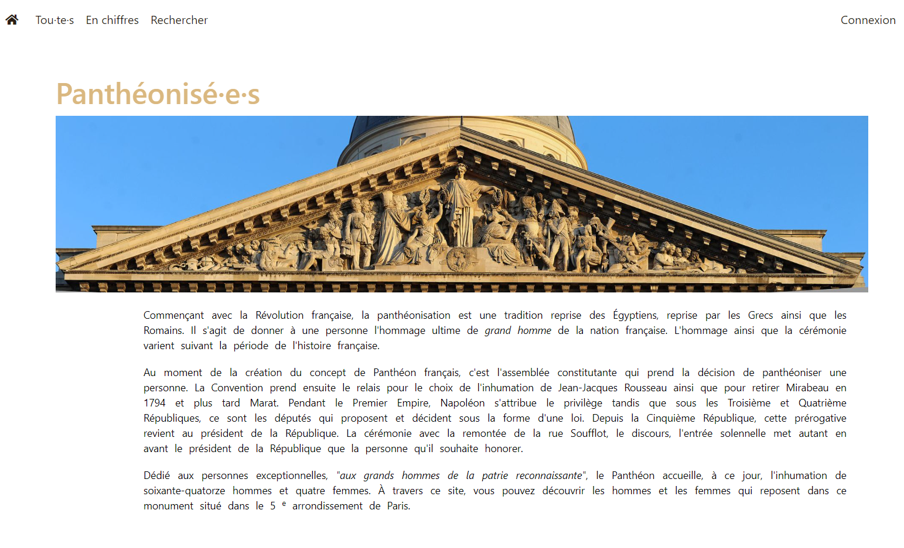

> Pour lire ces informations en français, [cliquez ici](README_french.md).

## The project
### About
This web app is developp by [Axelle Lecroq](https://github.com/axellelecroq) as part of the Master "Technologies appliquées à l'Histoire" of the [École nationale des chartes](http://www.chartes.psl.eu/fr/cursus/master-technologies-numeriques-appliquees-histoire).

The data used on the website comes from a public dataset available on [data.gouv](https://www.data.gouv.fr/fr/datasets/pantheonises/). However, the last persons buried in the Panthéon were added by myself, as well as the links to wikipedia pages and some photographs. This app was developed with Flask, an open-source web development framework in Python. However, CSS and HTML were widely used for the app's front-end as well as JavaScript for data visualizations with Plotly library. Many elements also come from Bootstrap tool collection. The database was built from SQLite and is managed with the ORM SQLAlchemy.

In case of problems with the use of the database or for any additional information, please contact me.

### Repository's structure
```
pantheonisees
    ├── app
    │   ├── modeles
    │   │       ├── data.py
    │   │       └── user.py
    │   ├── routes
    │   │       ├── crud_person.py
    │   │       ├── errors.py
    │   │       ├── generic.py
    │   │       ├── search.py
    │   │       └── user.py
    │   ├── static
    │   │       ├── css/...
    │   │       ├── images/...
    │   │       └── js
    │   │           ├── graph_pantheonisation_date.js
    │   │           ├── graph_per_status.js
    │   │           ├── select_gender.js
    │   │           └── select_status.js
    │   ├── templates
    │   │       ├── errors/...
    │   │       ├── layout/default.html
    │   │       ├── pages
    │   │       │      ├── about.html
    │   │       │      ├── connexion.html
    │   │       │      ├── dataviz.html
    │   │       │      ├── home.html
    │   │       │      ├── login.html
    │   │       │      ├── person_create.html
    │   │       │      ├── person_update.html
    │   │       │      ├── person.html
    │   │       │      ├── search.html
    │   │       │      └── toutes.html
    │   │       ├── partials
    │   │       │       ├── css.html
    │   │       │       └── metadata.html
    │   │       └── conteneur.html
    │   ├── constantes.py
    │   └── app.py
    ├── db_pantheonises.db
    ├── db_test.db
    ├── run.py
    └── tests.py
```

### Features

Accessible to all:
- search the database of pantheonised persons
- discover data visualisations

Available only to those who have created an account:
- add and delete a pantheonised person
- edit a pantheonised person's current registered informations
- add photographs to a pantheonised person

:film_strip: You can watch a 2mn video introducing the features by clicking on the screenshot below.

:source_information: The recording is not optimal as the contrast is a bit strong and viewers can't perfectly see the links on the app. Also, dropdown menus of the search form do not appear in the recording. Nevertheless, this video gives a good overview of the app's functionalitied and front-end.
[](https://user-images.githubusercontent.com/60888306/114012668-ec17c900-9866-11eb-9589-ee42c555e45d.mp4)

## Install and launch the app
### First launch

Prerequisite : python3  

*You can install it via this [website](https://www.python.org/downloads/). As a reminder: most Linux systems already have Python installed.*

1. Clone this git repository: `git clone https://github.com/axellelecroq/pantheonisees.git` and enter in the folder
2. Install a virtual environnement: `virtualenv -p python3 env` 
3. Activate the virtual env via `source env/bin/activate`
4. Install `requirements.txt`: renter in the folder `pantheonisees` and use this command line `pip install -r requirements.txt`
5. Launch the app : go to the level of `run.py` file and run this command line `python3 run.py`

### Launch 
1. Enter in the app folder
2. Activate the virtualenv: `source env/bin/activate`
3. Launch the app : go to the level of `run.py` gile and run this command line `python3 run.py`

### Tests 
To launch the tests:
1. Go to the level of `README.md` and `requirements.txt` files
2. Run this command line: `python -m unittest discover`
